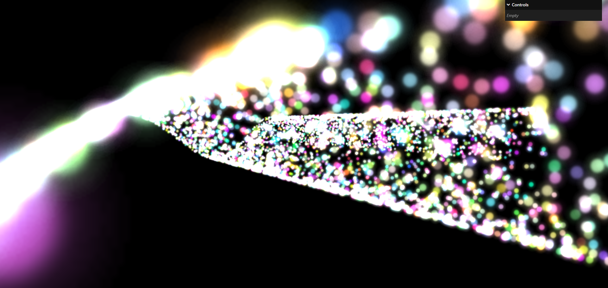

# Particles-JSS
Three.js Journey Lesson 17 'Particles'

## Application Deployed Link
https://particles-tjj.netlify.app

## Screenshot



## Description

Three.js Particles scene created using THREE.Points.

## Installation

1. Copy this GitHub repository
2. Run ``` npm install ``` to install dependencies on your machine.
3. Run ``` npm run dev``` to see the application.

## Credits

Bruno Simon at https://threejs-journey.com/